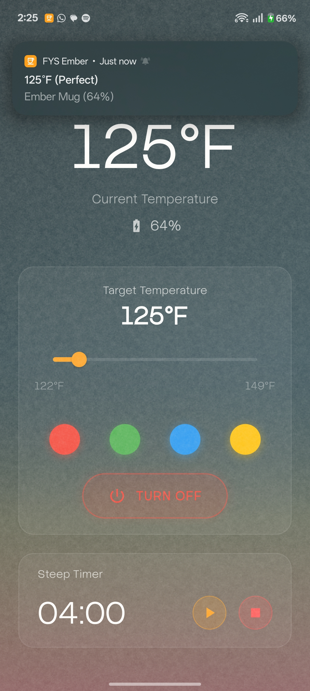
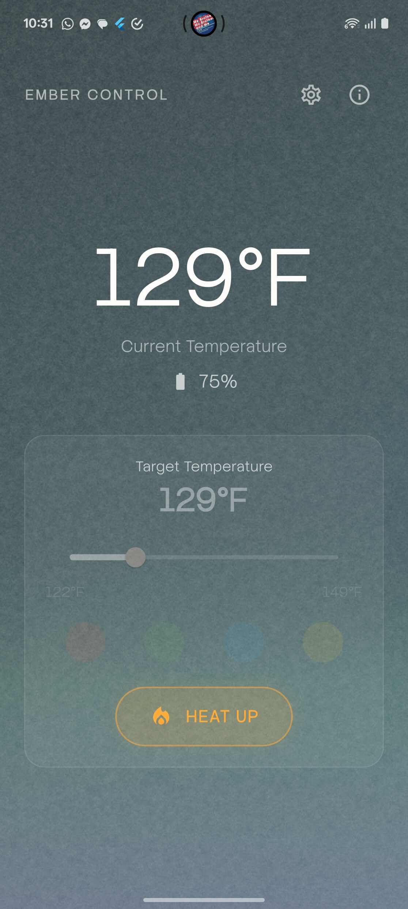

> **Special Thanks**: Thank you to the team behind [python-ember-mug](https://github.com/sopelj/python-ember-mug) for their work in reverse-engineering the Ember Mug Bluetooth protocol

# Fix Ur Shit Ember

A Modern, Feature-Rich Control App for Ember Mugs, built with Flutter.

  
  

## Features

*   **Smart Connectivity**
    *   **Auto-Connect:** Automatically finds and connects to your Ember Mug on launch.
    *   **Robust BLE:** Enhanced Bluetooth Low Energy handling for stable connections.
    *   **Auto-Reconnect:** Intelligent logic to recover lost connections.

*   **Temperature Control**
    *   **Live Monitoring:** Real-time display of current liquid temperature.
    *   **Precise Control:** Easy-to-use slider to set your perfect drinking temperature.
    *   **Heat Toggle:** One-tap button to turn heating on or off instantly.
    *   **Smart Memory:** Remembers your last used target temperature.

*   **Intelligent Features**
    *   **Empty Cup Detection:** Automatically turns off heating when the cup is empty to save battery.
    *   **Battery Status:** View real-time battery percentage and charging status.
    *   **Live Notifications:** persistent notification showing current temperature and status (Heading, Off, Perfect) so you don't have to open the app.
    *   **LED Customization:** Change the LED color on your mug to match your mood.

*   **Premium Design**
    *   **Modern Aesthetics:** Beautiful gradients and glassmorphism UI.
    *   **Paper Texture:** Subtle texture overlay for a unique, organic feel.
    *   **Visual Feedback:** Dynamic color changes based on heating state (Orange for heating, Blue for cooling/off).
